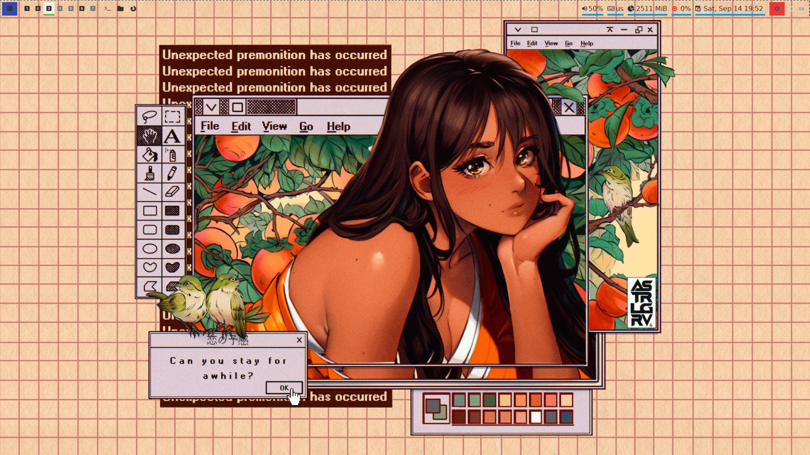
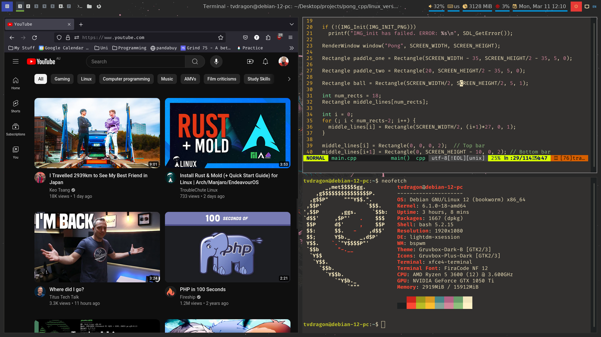
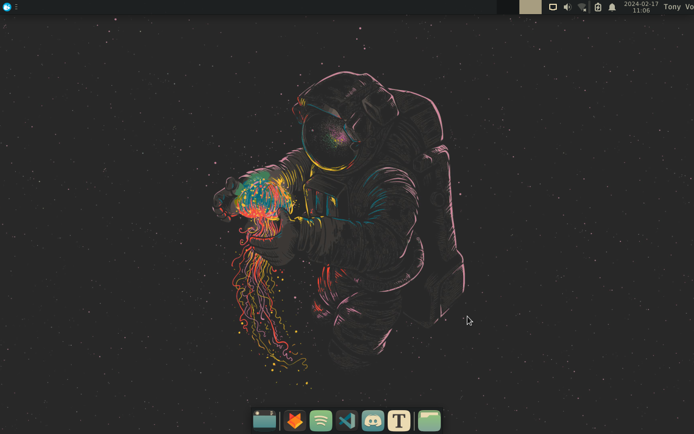

<h1 align="center">Polar Space</h1>

Polar Space is a minimialistic Linux setup for Debian using the Gruvbox Dark B Theme. This setup uses BSPWM or XFWM4 as the window manager.

## Screenshots of the Desktop
### 1) Home Screen BSPWM

### 2) Tiles

### 3) Home Screen XFWM4

## Dependencies for BSPWM
- bspwm
- sxhkd
- polybar
- picom
- rofi
- xfce4-terminal

## Dependencies for XFWM4
- xfwm4
- xfce4-settings
- xfce4-panel
- xfce4-whiskermenu
- xfce4-terminal

## Installation Steps (Debian Server netinst.iso)
**NOTE:** This guide uses ``~/`` as the default path for cloning repos

1. First you will need to use the debian server netinst iso image which can be installed from:

* [![Debian][debian]][Debian-url]

2. Flash debian server netinst onto a usb and install the system onto your drive.
3. Update your repositories:

		sudo apt update
4. Upgrade your system:

		sudo apt upgrade
5. Optional Changes for changing terminal emulator

	Before running the script you may wish to use a different terminal emulator. If so, then open up ``setup.sh`` script and change xfce4-terminal to your desired terminal emulator.

	- BSPWM

		Afterwards open up ``dotconfigs/sxhkd/sxhkdrc`` and change and change the command ``xfce4-terminal`` to the command for your desired terminal emulator.
	
	- XFWM4

		After running step 6, reboot the system and go to keyboard shortcuts to change which terminal to open by default when entering the commands for Ctrl + Alt + t.
6. Run the ``setup.sh`` script:

		sh setup.sh

[debian]: https://img.shields.io/badge/Debian-FFFFFF?style=for-the-badge&logo=debian&logoColor=red
[Debian-url]: https://www.debian.org/
